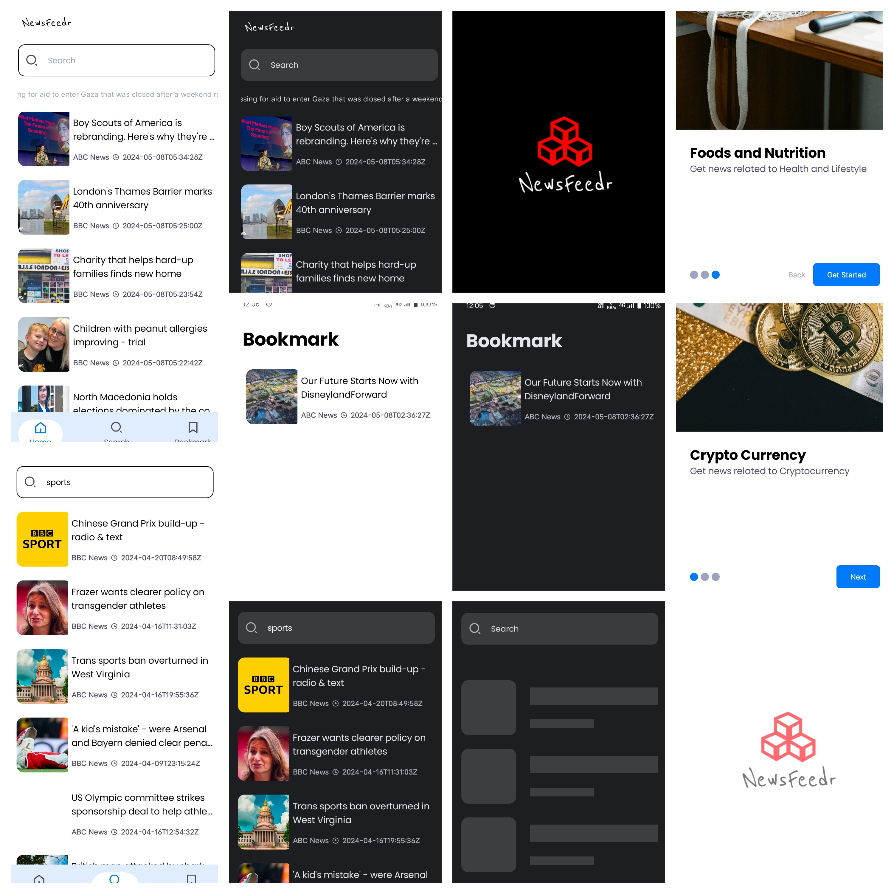

🚀 Welcome to NewsFeedr!

NewsFeedr is a cutting-edge news application designed to keep you informed with the latest updates. Built with Jetpack Compose for a sleek user interface, this app offers a seamless browsing experience. Search for news, bookmark articles, and explore curated content effortlessly.

## Key Features:
- Dynamic Home Screen: Explore curated news right from the home screen.
- Search Functionality: Find articles on topics that matter to you.
- Bookmarking: Save your favorite articles for later.
- Smooth Navigation: Enjoy a seamless browsing experience.
- Dependency Injection: Built with Dagger Hilt for optimal performance.
- Pagination: Implemented using Paging 3 library for smooth scrolling.
- Error Handling: Seamless handling of errors and loading states.

## Images:

## Getting Started:
1. Clone the repository.
2. Install dependencies.
3. Run the app on your device.

## Contributing:
Contributions are welcome! Fork the repository and submit a pull request with your enhancements.